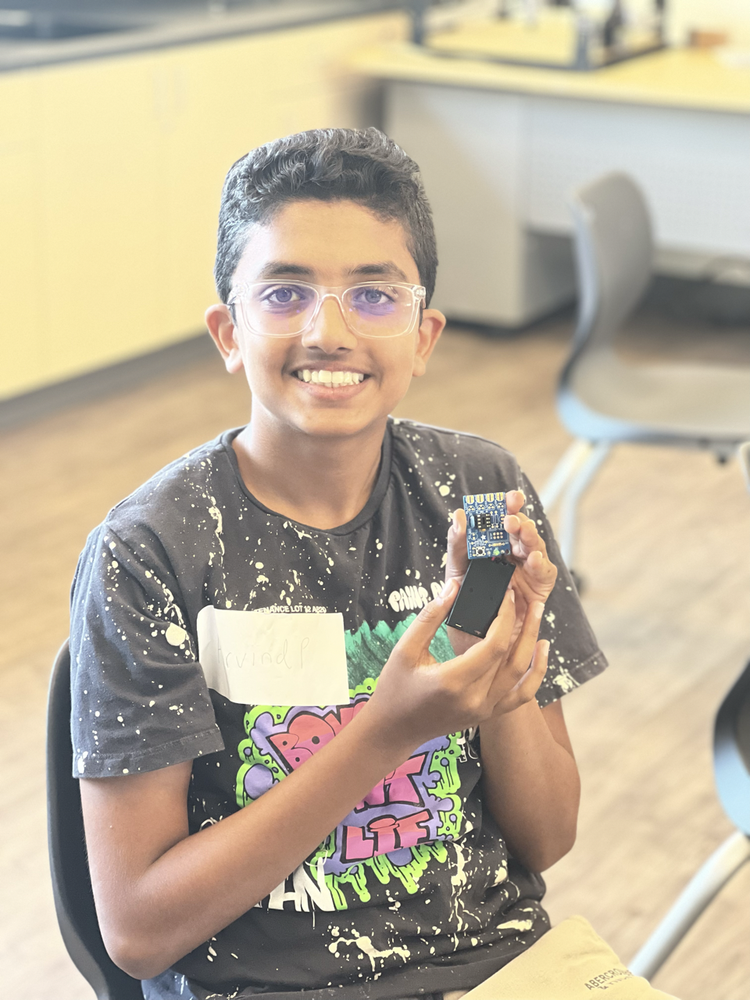
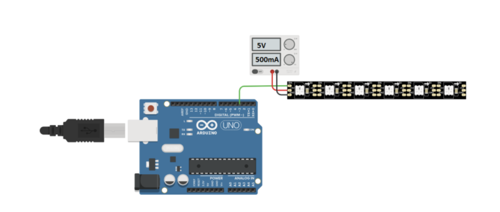
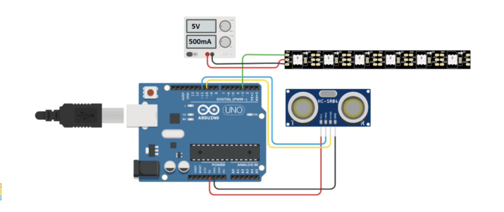
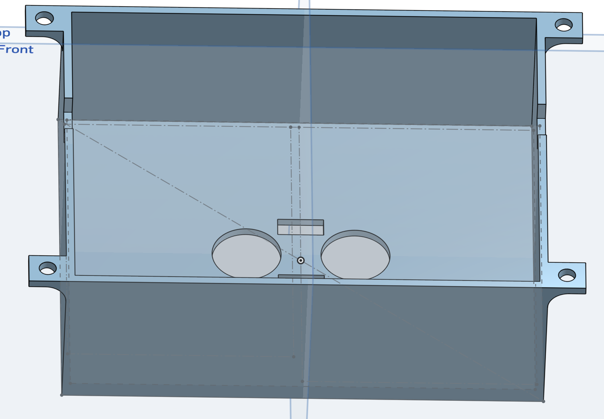

# Garage Parking Assistant 
My project is the garage parking assistant. This is a device programmed to help a car park in a tight garage by putting a red light if the car is getting close to the wall to prevent the car from hitting the wall. When a car is backing out it returns to a green light indicating the car has plenty of space in front of it.

| **Engineer** | **School** | **Area of Intrest** | **Grade** |
|:--:|:--:|:--:|:--:|
| Arvind P| Mountain View High School | Hardware Engineering | Incoming Freshman



# Final Milestone (Mods Milestone)


<iframe width="560" height="350" src="https://www.youtube.com/embed/T4bwgNHG_60" title="Arvind P. Final Milestone" frameborder="0" allow="accelerometer; autoplay; clipboard-write; encrypted-media; gyroscope; picture-in-picture; web-share" allowfullscreen></iframe>


My final milestone (Or modification milestone) was completing the 3D CAD design for my Garage Parking Assistant. Since my previous milestone I was able to organize all the wires and put it inside of the new 3D printed CAD. The CAD design took a few days to complete entirely on Onshape. This included a lot of time trying to perfect the tolerances for all the holes for the ultrasonic sensor. Making the holes all centered took some time as well however once I got the hang of doing it I was able to do it fine. One of my biggest challenges in my time here at BlueStamp were unsoldering clogged solder, debugging code in C++, and CADing the holes for the ultrasonic sensor. My biggest triumphs here at BlueStamp included seeing my TV Be Gone actually turn on a TV, seeing my LED strip finally turn on after so much hardship with it not working, and seeing my 3D printed case actually fit everything flush. Some of the key things I learned here at BlueStamp include how to solder things together, coding in C++ for Arduino IDE, learning how to CAD in Onshape, and most of all learning how to persevere through tough hardships in my project to end up making it work. In the future I would like to use what I have learned in BlueStamp in Mechanical Engineering clubs in High School or even other class opportunities to learn even more!


# Third Milestone

<iframe width="560" height="350" src="https://www.youtube.com/embed/jUr4x9YDDTo" title="Arvind P. Milestone 3" frameborder="0" allow="accelerometer; autoplay; clipboard-write; encrypted-media; gyroscope; picture-in-picture; web-share" allowfullscreen></iframe>


My third milestone was being able to complete the entire garage parking assistant project. This included completing the light and ultrasonic portion of the project, as well as combining the two by coding it so that the light acts in accordance with the ultrasonic sensor. I was able to fix the code inorder to make it work between the time of the last milestone till the time that I finished this one. A major challenge I faced with my third project was the code working sometimes but not other times. This was a problem that took me a day to debug. However, something to note is to always quadruple check that your pins are set to the right thing. Because this is something that is pretty easy to miss and even through debugging it's hard to see. So it is very good if you start by checking if all of your pins are correct and are set to the correct thing in order to not waste time trying to study your entire code to debug the issue. Another challenge that I faced was the ultrasonic sensor not reading its data when the code tells it to. This is another problem that is very avoidable. A common issue that causes this is the serial monitor not being refreshed. I didn’t realize this was the problem until I tried to refresh the serial monitor and sure enough the ultrasonic sensor values began showing up. Overall there are many issues that could be easily avoidable. For any other issues like this you can look at the troubleshooting section in the schematics.


# Second Milestone

<iframe width="560" height="350" src="https://www.youtube.com/embed/lh4tWKUuAtc" title="Arvind P. Milestone 2" frameborder="0" allow="accelerometer; autoplay; clipboard-write; encrypted-media; gyroscope; picture-in-picture; web-share" allowfullscreen></iframe>


My second milestone was completing the LED strip part of my Garage Parking Assistant project. This is the part of the project that will be the guide for the vehicles to act according to what the light says. For example if it is red that means that there is plenty of space to go forward however it is red there is no more space to move forward and the vehicle should stop. Some of the components include a data cable, the power and ground cables, and the actual LED strip itself. Something that has been surprising is that just the regular wall outlet plug that connects to the LED is not the only thing that needs to be plugged in inorder to make the light actually light up. It also needs to be plugged into the arduino itself. That also happened to be the biggest challenge of this part of the project for me. The debugging took a lot of time to fully figure out, but once I did I was able to make the light activate. A challenge that was reoccurring for me was understanding the code, however this time I was able to fix it a bit faster because I already had some experience working with the code. I now need to re-wire some of the ground and power cables into a breadboard to make it easier to manage all of the cables in one place.


# First Milestone

<iframe width="560" height="350" src="https://www.youtube.com/embed/GFauvsFPPtU" title="Arvind P. Milestone 1" frameborder="0" allow="accelerometer; autoplay; clipboard-write; encrypted-media; gyroscope; picture-in-picture; web-share" allowfullscreen></iframe>


My first milestone was completing the ultrasonic sensor part of my garage parking assistant project. It is the part of the project that will detect how far the vehicle is from hitting the wall. Some of the components of the project include the ultrasonic sensor itself, ground and power cables, and Trig and Echo pins. A challenge I am faced with in my project that I can prevent in future projects is knowing how to actually code in C++! Before working on this part of my project I had know idea how to code in C++. However once I learned some of the basics I was able to make it work and read all of the distances. There weren’t any challenges that I had faced while making the ultrasonic sensor work that I had faced while making the Tv Be Gone. My plan to complete the project is to combine this to the LED. The LED will be working in correspondence to the LED and once I can make the LED work I will be able to combine the two and have a working Garage Parking Assistant!

 
# Starter Project

<iframe width="560" height="350" src="https://www.youtube.com/embed/TGxNgDbHCbw" title="Arvind P. Starter Project" frameborder="0" allow="accelerometer; autoplay; clipboard-write; encrypted-media; gyroscope; picture-in-picture; web-share" allowfullscreen></iframe>

My starter milestone was completing my starter project which was the Tv Be Gone. The Tv Be Gone is a Tv remote that can work anywhere on any Tv! Some of the components of the project include a button which is connected to a light that is programmed so that when the button is pressed the light will illuminate. A microcontroller that tells 4 infrared lights to send signals to Tv's to connect to them. There are also 4 resistor’s that regulate the flow of electricity in the remote. Some of the technical progress that I have made in my project include learning that filling holes with solder inside of the board will be a huge pain to get rid of. I also learned to be very careful when inserting resistors into the board as they can break easy when inserting. A challenge I have faced in my project that I have solved in my intensive project was not heating the heat shrink enough which makes the connection inside of the heat shrink weaker and as a result creating an issue in the project. This was fixed when using a heat shrink in my main project as I saw if the jap between the heat shrink and the wire was small enough and once it was I knew it could be sturdy enough. I will use the information I have learned in making my starter project and use it as my intensive project.


# Schematics 


When starting the project you will need to connect your data cable into digital 3 in your arduino uno board.



You can also connect your ultrasonic sensor to your arduino uno board. You can connect the trig and echo pins into digtal 10 and 11. 



This is my 3D design for my case for the arduino, breadboard, and ultra sonic sensor. If you want to use the same design, the link is below if you would like to use this design in you project. 


<a href="https://cad.onshape.com/documents/bf41ee9f11c978e11e3394a0/w/dbc2a44016fd211d42193612/e/19b8ec18d65992c16a4828b4"> Link to CAD </a> |


# Troubleshooting
While making this project you may encounter some issues that can easily be avoided. I myself encountered some wierd problems that ended up being an easy fix.

1. When using the LED with a barrel jack adapter at the end of it you have two options; One, you can continue using the barrel jack while making wires attached to it to plug into the data cable as well as the 5v and Ground.
   Two, you can cut the barrel jack and strip the wire a bit. Then solder a wire to the 5v (The red frayed wire) and the ground (The black frayed wire). These wires will act as your power and ground which can directly connect to       the LED on the power and ground. You can then solder another wire to act as your data cable.
2. If for some reason your LED is not getting power from the 5V's from the wall plug you should try to plug it into the arduino as well. For some reason this was an issue I encountered and once I put it into my arduino it worked.      For this you can use a breadboard to give power to all the components. However if this problem does occur, you will need to plug the 5v and ground into the breadboard instead of directly to the LED.
3. When coding in the arduino IDE be sure to try and make your ultrasonic sensor read its data first in order to make sure that it works. You will want to make it read in the Serial Monitor on the arduino IDE. You can access my        code below as the written version. This has the code already in place, but make sure you check everything and debug it if there are any issues in order to make it work.
4. When CADing the design if you desire to make your own CAD model for the case for the arduino, breadboard, and the ultrasonic sensor triple check your tolerances for any hole that you make in it. Trust me this will save you a lot    of trouble!!! If you don't want to make your own design my design is above if you would like to use it.
5. Have patience if something doesn't work. When building things, in fact when doing anything in mechanical engineering it will require a lot of patience and time to make things work. Nothing will work on the first try and it will     take a lot of debugging and troubleshooting to make things work, but if you keep on persevering through it you will end up with a super cool and neat project at the end! And always if you need help ask your instructors.

# Code for Garage Parking Assistant
```
#define trigPin       10  // ultrasonic sensro trig ping
#define echoPin       11  // ultrasonic sensro echo ping
#define NUM_LEDS      47  // How many leds in your strip?
#define DATA_PIN      3   // data pin for LED strip
#define ZONE          30  // default zone distance is 30 cms / a foot
#define MAXRR         30  // default distance for Flashing Red is 30 cms / a foot
#define MAXR          MAXRR+ZONE  // distance for Red
#define MAXY          MAXR+ZONE   // distance for Yellow/Amber
#define MAXG          MAXY+ZONE   // distance for Green
#define MAXFLASHCOUNT 30  // max times to flash

CRGB leds[NUM_LEDS];        // Define the array of leds

float duration, distance;
int flashcount, LEDpercm;

void setup() 
{
  // initialize the LED strip
  //FastLED.addLeds<WS2812B, DATA_PIN, GRB>(leds, NUM_LEDS);  // GRB ordering is typical
FastLED.addLeds<NEOPIXEL,3>(leds, NUM_LEDS);
  FastLED.clear();  // clear all pixel data
  FastLED.show();
  pinMode(trigPin, OUTPUT);
  pinMode(echoPin, INPUT);
  // set the trig and echo pin modes

  LEDpercm = NUM_LEDS / ZONE ; // number of LEDs to glow per cm of distance measured
  int n = 0;
  for(int n = 0; n < NUM_LEDS/2; n++);  //code to run leds as red 
    leds[n] = CRGB (255, 0, 0);
    fill_solid(leds, NUM_LEDS, CRGB::Red); 
  Serial.begin(9600);
}

void loop() 
{
  CallSensor();
}

void CallSensor()
{
  // initiate ultrasonic sensor to fire
  digitalWrite(trigPin, HIGH);
  delayMicroseconds(10);
  digitalWrite(trigPin, LOW);

  duration = pulseIn(echoPin, HIGH);
  distance = (duration / 2) * 0.0344; // use speed of sound to calc rountrip distance and divide by 2 to get one way distance
  Serial.println(distance);
  delay(200); // give a delay between successive firings of ultrasonic sensor

  if (distance > MAXG) // if distance is greater than MAXG clear all LEDs
  {
    fill_solid( leds, NUM_LEDS, CRGB::Black); 
    FastLED.show();
    return;
  }
  else if (distance > MAXY && distance < 60) 
    ChangePixelColors(MAXG, distance, 0, 255, 0); // green color
  else if (distance > MAXR && distance < MAXY) 
    ChangePixelColors(MAXY, distance, 255, 126, 0); //Amber color
  else if (distance > MAXRR && distance < MAXR) 
    ChangePixelColors (MAXR, distance, 255, 0, 0); //red color
  else if (distance <= MAXRR) // we are in SOS zone, show flashing red
    ShowFlashingRed();
}

void ShowFlashingRed()
{
  if (flashcount >= MAXFLASHCOUNT) //stop flashing after MAX times
  {
    fill_solid( leds, NUM_LEDS, CRGB::Black);
    FastLED.show();
    return;
  }

  flashcount++; // increment the times we have flashed red

  fill_solid( leds, NUM_LEDS, CRGB(255, 0, 0)); //fill full LED strip with red color
  FastLED.show();
  delay (250);
  fill_solid( leds, NUM_LEDS, CRGB::Black);
  FastLED.show();
  delay (250);
}

void ChangePixelColors(int zonemax, float distance, int R, int G, int B)
{
  int countLED;
  fill_solid(leds, NUM_LEDS, CRGB::Black); // reset the LED strip to black (or blank)

  // calculate the difference of distance between zone max and object distance. This is the distance
  // the object is at within the zone. E.g if zonemax is 120cm and object is at 100cm, we get 20cm
  // Use this 20cm and LEDpercm to calculate how many LEDs to show
  countLED = round((zonemax - distance)* LEDpercm) ; 
   
  for (int n = 0; n <= countLED; n++) // fill the LEDs with right color and until countLED 
    leds[n] = CRGB (R, G, B);
  
  FastLED.show();
  flashcount = 0; // we are no longer flashing red so reset this to zero
}
```

# Bill of Materials

| **Part** | **Note** | **Price** | **Link** |
|:---:|:---:|:---:|:--:|
| LED | This is used to tell the car how to act through color. | $33.99 | <a href="https://www.amazon.com/BTF-LIGHTING-Flexible-Individually-Addressable-Non-waterproof/dp/B01CDTEJBG/ref=sr_1_1_sspa?crid=2EJY8BP7FFZ2U&keywords=ws2812b%2Bled%2Bstrip&qid=1686776906&sprefix=WS2812B%2BL%2Caps%2C218&sr=8-1-spons&spLa=ZW5jcnlwdGVkUXVhbGlmaWVyPUFTSU5NRk1GRUhBU0gmZW5jcnlwdGVkSWQ9QTA1MTg1NTUzSjBJSVY0QTVJRUxOJmVuY3J5cHRlZEFkSWQ9QTEwMDM4MzQxNFM3NEk2TEpKODBWJndpZGdldE5hbWU9c3BfYXRmJmFjdGlvbj1jbGlja1JlZGlyZWN0JmRvTm90TG9nQ2xpY2s9dHJ1ZQ&th=1"> Link </a> |
| 5V Power Supply | This item is used to power all of the componets in my project. | $10.99 | <a href="https://www.amazon.com/3000mA-Volts-Adapter-Power-Supply/dp/B0852HCM8S/ref=sr_1_2_sspa?crid=3PFCATRNI6WRB&keywords=5v+barrel+jack+power+supply&qid=1687560544&sprefix=5v+barrel+j%2Caps%2C271&sr=8-2-spons&sp_csd=d2lkZ2V0TmFtZT1zcF9hdGY&psc=1"> Link </a> |
| Ultrasonic Sensor | This item tells the distance of the car that is either coming or going. | $6.99 | <a href="https://www.amazon.com/WWZMDiB-HC-SR04-Ultrasonic-Distance-Measuring/dp/B0B1MJJLJP/ref=sr_1_1_sspa?crid=2LCIWSS7GNM2P&keywords=ultrasonic+sensor+arduino&qid=1687561198&sprefix=ultrasonic+senso%2Caps%2C213&sr=8-1-spons&sp_csd=d2lkZ2V0TmFtZT1zcF9hdGY&psc=1"> Link </a> |
| Arduino Uno | This is the device that you plug in all of your wires and takes in the code from your computer to make the code get onto all of your componets. | $28.50 | <a href="https://www.amazon.com/Arduino-A000066-ARDUINO-UNO-R3/dp/B008GRTSV6/ref=sr_1_1_sspa?crid=25F69CU9EEICD&keywords=arduino+uno&qid=1687805603&sprefix=arduino%2Caps%2C304&sr=8-1-spons&sp_csd=d2lkZ2V0TmFtZT1zcF9hdGY&psc=1"> Link </a> |
| Breadboard | This is the device where you can connect your wires that need to be powered into it as well as your 5V power supply for easier access to get all power in one place. | $8.99 | <a href="https://www.amazon.com/SchmalzTech-Solderless-Breadboard-Electronics-Prototyping/dp/B0B1XGCFGW/ref=sr_1_7_sspa?crid=189NUEU8UW3Y5&keywords=small+bread+board+electronics+one&qid=1687806083&sprefix=small+bread+board+electronics+one+%2Caps%2C131&sr=8-7-spons&sp_csd=d2lkZ2V0TmFtZT1zcF9tdGY&psc=1"> Link </a> |

# Other Resources
Here are some of the resources that I used for my project:
1. <a href="https://makezine.com/projects/arduino-powered-garage-parking-sensor/"> Instructions </a> |
2. <a href="https://projecthub.arduino.cc/Bcjams/garage-parking-assistant-55c22c"> Arduino Instructions </a> |
3. <a href="https://3dchimera.com/blogs/connecting-the-dots/3d-printing-tolerances-fits"> CAD Tolerances </a> |
4. <a href="https://docs.arduino.cc/software/ide-v2/tutorials/ide-v2-debugger"> Debugging in Arduino (C++) </a> |
